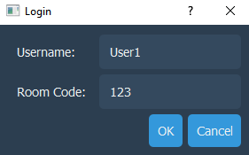
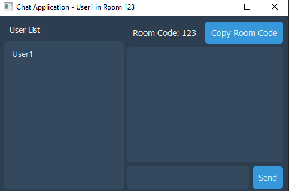
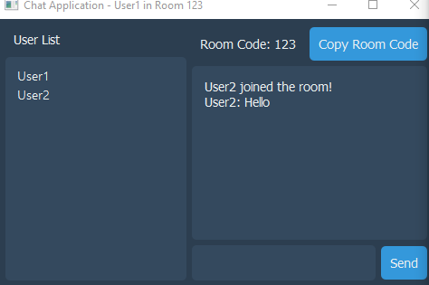

# Simple Chatting App With Python
#### Video Demo:  <URL https://www.youtube.com/watch?v=2Lm5hWiGmNg>

# Chat Application Project

Welcome to the Chat Application Project! This project demonstrates a basic yet fully functional chat application built with Python, utilizing sockets for server-client communication and PyQt5 for the graphical user interface.

## Features

- **Real-time Communication:** Users can join existing chat rooms or create new ones and communicate in real-time.
- **Participants List:** Displays a list of all participants currently in the chat room.
- **User Notifications:** Notifies all users when someone joins or leaves the chat room.
- **User-Friendly Interface:** Built using PyQt5 for a modern and intuitive user experience.

## Prerequisites

Before you begin, ensure you have PyQt5 installed. 
You can install it using pip: pip install PyQt5

## Screen Shots

